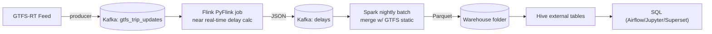

### Real-Time & Batch Data Pipeline for Public Transit Analytics

End-to-end stack to ingest GTFS-RT, process delays in near real time, run nightly batch aggregations, and query results in Hive. Includes Kafka, Flink, Spark, Airflow, Hive, and Jupyter for visualization.

### Architecture



### Services
- Kafka/Zookeeper: message bus for streaming data
- Flink: consumes trip updates and computes windowed delays to `delays` topic
- Spark: nightly batch merging real-time delays with GTFS schedule, writing Parquet
- Hive: external tables over Parquet in `warehouse/`
- Airflow: orchestrates nightly Spark batch (and can be extended)
- Jupyter: quick notebooks over Parquet outputs

### Getting started
1) **Prerequisites**: Docker Desktop with >= 8 GB RAM allocated.

2) **Configure real GTFS-RT feed** (optional - defaults to demo mode):
   ```bash
   cp env.example .env
   # Edit .env with your feed URL and API key
   ```

3) **Start the stack**:
   ```bash
   docker compose up -d --build
   ```

4) **Health check**:
   ```bash
   python monitoring/healthcheck.py
   ```

4) UIs
- Kafka UI: `http://localhost:8083`
- Flink UI: `http://localhost:8081`
- Spark Master UI: `http://localhost:8082`
- Airflow: `http://localhost:8089` (user: admin / pass: admin)
- Jupyter: `http://localhost:8888` (token: dev)

### Project layout
- `ingestion/producer/` – Python Kafka producer for GTFS-RT
- `flink/jobs/` – PyFlink job for near real-time delay calculations
- `spark/jobs/` – PySpark nightly aggregations
- `airflow/dags/` – DAGs to orchestrate batch
- `hive/` – sample queries and DDLs
- `warehouse/` – Parquet outputs (mounted into Spark and Hive)
- `notebooks/` – example notebook for charts

### Data flow details
1) Ingestion: `gtfs_rt_kafka_producer.py` decodes GTFS-RT protobuf and writes compact JSON events to Kafka topic `gtfs_trip_updates`.

2) Streaming (Flink): `pyflink_delays_job.py` reads `gtfs_trip_updates` (Kafka) and produces windowed average delays to topic `delays`.

3) Batch (Spark): `nightly_aggregations.py` runs daily (via Airflow) to:
- Read `delays` from Kafka
- Join with GTFS static (CSV files placed under `data/gtfs_static/`, see comments in the job)
- Write Parquet aggregates to `warehouse/aggregates/...`

4) Hive: Create external tables over Parquet outputs. See `hive/sample_queries.sql` for DDL and example analytics queries.

### Example analytics
- Average delay per route per day
- Top 5 delayed routes in last 30 days
- On-time performance trend
- Heatmap of delays by hour and geography

### Airflow
- DAG: `batch_daily_aggregations` runs at 01:00 daily. It shells into Spark master container to run `spark-submit` with Kafka package dependency.

### Notes
- Flink needs connector JARs. A small init script auto-downloads Kafka and JSON connectors at container start.
- Some GTFS-RT feeds require an API key – set `GTFS_API_KEY` if needed. The producer includes a `--demo` mode with synthetic events for quick smoke-tests.

### Stop / teardown
```bash
docker compose down -v
```

### License
MIT

